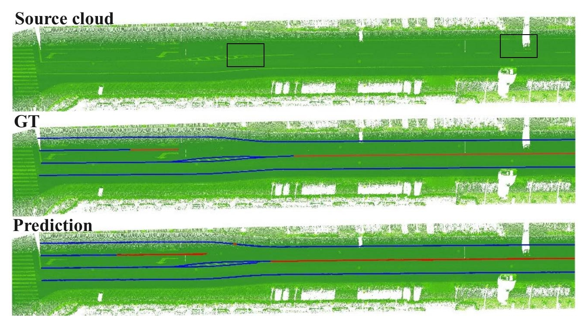

<h2>
<a href="https://whu-usi3dv.github.io/LaneMapping/" target="_blank">A Benchmark Approach and Dataset for Large-scale Lane Mapping from MLS Point Clouds</a>
</h2>

This is the official PyTorch implementation of the following publication:

><br>**A Benchmark Approach and Dataset for Large-scale Lane Mapping from MLS Point Clouds** </br>
><br> [Xiaoxin Mi](https://mixiaoxin.github.io/), [Zhen Dong](https://dongzhenwhu.github.io/index.html), Zhipeng Cao, [Bisheng Yang](https://3s.whu.edu.cn/info/1025/1415.htm),[Zhen Cao](https://github.com/a4152684), Chao Zheng, [Jantien Stoter](https://3d.bk.tudelft.nl/jstoter/), [Liangliang Nan](https://3d.bk.tudelft.nl/liangliang/) </br>
> <br>*International Journal of Applied Earth Observation and Geoinformation(JAG) 2024* </br>
> [**Paper**](https://www.sciencedirect.com/science/article/pii/S156984322400493X) | [**Project-page**]() | [**Video**]()

## 🔭 Introduction

<p align="center" style="font-size:18px">
<strong>A Benchmark Approach and Dataset for Large-scale Lane Mapping from MLS Point Clouds</strong>
</p>


<p align="justify">
<strong>Abstract:</strong> Accurate lane maps with semantics are crucial for various applications, such as high-definition maps (HD Maps), intelligent transportation systems (ITS), and digital twins. Manual annotation of lanes is labor-intensive and costly, prompting researchers to explore automatic lane extraction methods. 
This paper presents an end-to-end large-scale lane mapping method that considers both lane geometry and semantics.
This study represents lane markings as polylines with uniformly sampled points and associated semantics, allowing for adaptation to varying lane shapes. Additionally, we propose an end-to-end network to extract lane polylines from mobile laser scanning (MLS) data, enabling the inference of vectorized lane instances without complex post-processing. The network consists of three components: a feature encoder, a column proposal generator, and a lane information decoder. 
The feature encoder encodes textual and structural information of lane markings to enhance the method's robustness to data imperfections, such as varying lane intensity, uneven point density, and occlusion-induced incomplete data. The column proposal generator generates regions of interest for the subsequent decoder. Leveraging the embedded multi-scale features from the feature encoder, the lane decoder effectively predicts lane polylines and their associated semantics without requiring step-by-step conditional inference.
Comprehensive experiments conducted on three lane datasets have demonstrated the performance of the proposed method, even in the presence of incomplete data and complex lane topology.
</p>

## 🆕 News

- 2024-09-10: [LaneMapping] code and dataset are publicly accessible! 🎉
- 2024-09-02: our paper is accepted for publication in the International Journal of Applied Earth Observation and Geoinformation(JAG)! 🎉

## 💻 Requirements

The code has been trained on:

- Ubuntu 20.04
- CUDA 11.8 (Other versions should be okay.)
- Python 3.8
- Pytorch 2.1.0
- A GeForce RTX 4090.

## 🔧 Installation

#### a. Create a conda virtual environment and activate it.

```
conda create -n lanemap python=3.8 -y  
conda activate lanemap
```

### b. Install PyTorch and torchvision following the official instructions.

```
pip install torch==2.1.0 torchvision==0.16.0 torchaudio==2.1.0 --index-url https://download.pytorch.org/whl/cu118
```

### c. Install mmcv-full. (optional: to validate LidarEncoder: SparseConv)

Follow the instructions here: https://mmdetection3d.readthedocs.io/en/latest/get_started.html

```
pip install -U openmim
mim install mmengine
mim install 'mmcv>=2.0.0rc4'
mim install 'mmdet>=3.0.0'
```

```
git clone https://github.com/open-mmlab/mmdetection3d.git -b dev-1.x
# "-b dev-1.x" means checkout to the `dev-1.x` branch.
cd mmdetection3d
pip install -v -e .
# "-v" means verbose, or more output
# "-e" means installing a project in editable mode,
# Thus, any local modifications made to the code will take effect without reinstallation.
```

### d. install other third party libs

```
pip install einops==0.8.0
pip install timm
pip install laspy  # to load LiDAR points
pip install pytorch_warmup
```

## Train and Test

```
export PATH=$PATH:/path/to/your/lanemap/dir  # set the work path
```

## 💾 Datasets

We used WHU-Lane for training and three datasets for evaluation.

#### WHU-Lane

WHU-Lane data structure is as follows:

```
mkdir data
cd data
ln -s /path/to/downloaded/WHU-Lane .
```

```
WHU-LaserLane
├── TrainValAll
│    ├── cropped_tiff
│    │    ├── 000000_0001.png
|    |    ├── 000000_0002.png
│    │    └── ...
│    ├── labels
│    │    ├── sparse_seq
|    |    ├── sparse_instance
|    |    ├── sparse_orient
|    |    ├── sparse_endp
│    │    └── sparse_semantic
│    └── ...
├── TestArea1
│    ├── cropped_tiff
│    │    ├── 000000_0001.png
|    |    ├── 000000_0002.png
│    │    └── ...
│    ├── labels
│    │    ├── sparse_seq
|    |    ├── sparse_instance
|    |    ├── sparse_orient
|    |    ├── sparse_endp
│    │    └── sparse_semantic
│    └── ...
└── TestArea2
     ├── cropped_tiff
     │    ├── 000000_0001.png
     |    ├── 000000_0002.png
     │    └── ...
     ├── labels
     │    ├── sparse_seq
     |    ├── sparse_instance
     |    ├── sparse_orient
     |    ├── sparse_endp
     │    └── sparse_semantic
     └── ...
```

## 🚅 Pretrained model and WHU-LaserLane Dataset

You can download the pre-trained model from[BaiduDisk](https://pan.baidu.com/s/1F5iAXs6HzHxWmJ4dwGBEmw?pwd=y2z9) or [GoogleDrive](https://drive.google.com/file/d/13QCwtbl45nyOOWTN8AyUgc_9z66Dyz0c/view?usp=sharing), and put it in folder `logs/` and unzip it.

You can download only the generated BEV images and corresponding annotations of WHU-LaserLane dataset from[BaiduDisk](https://pan.baidu.com/s/1yiuU_V3VlTw7ogD8Tjjvag?pwd=47v6) or [GoogleDrive](https://drive.google.com/file/d/16YDb_cwFr5iLkLzQSnuhkULjJ4JfjNIJ/view?usp=sharing), and put it in folder `./data/` and unzip it.

Or the whole WHU-LaserLane dataset from [BaiduDisk](https://pan.baidu.com/s/1u6ASAP3YyDUJFdyuq_dW4g?pwd=uupb).

## ⏳ Train

To train the LaneMapping network, prepare the dataset and put it in  './data/.'. Then, you use the following command:

```bash
$ python train_gpu_0.py
```

## ✏️ Test

To evaluate LaneMapping on the other two test areas, you can use the following commands, and do not forget to modify the corresponding datapath in the config file:

```bash
$python test_gpu_0.py
```

## ✏️ Project point cloud to the BEV image
If you want to follow the BEV generation pipeline (preprocessing) in this article, please refer to [Las2BEV](https://github.com/MIXIAOXIN/Las2BEV)

## ✏️ Merge local lane map to the global map

Firstly, the predicted lanes on BEV are converted to the LiDAR coordinate system.
```bash
$python ./baseline/utils/coor_img2pc.py
```

Then, merge the local lane map to the global lane map.
```bash
$python ./baseline/utils/merge_lines.py
```

## 💡 Citation

If you find this repo helpful, please give us a 😍 star 😍.
Please consider citing **LaneMapping** if this program benefits your project

```Tex
@article{MI2024104139,
title = {A benchmark approach and dataset for large-scale lane mapping from MLS point clouds},
journal = {International Journal of Applied Earth Observation and Geoinformation},
volume = {133},
pages = {104139},
year = {2024},
issn = {1569-8432},
doi = {https://doi.org/10.1016/j.jag.2024.104139},
url = {https://www.sciencedirect.com/science/article/pii/S156984322400493X},
author = {Xiaoxin Mi and Zhen Dong and Zhipeng Cao and Bisheng Yang and Zhen Cao and Chao Zheng and Jantien Stoter and Liangliang Nan}
}
```

## 🔗 Related Projects

We sincerely thank the excellent projects:

- [KLane](https://github.com/kaist-avelab/K-Lane.git) for base code framework;
- [MapTR](https://github.com/hustvl/MapTR) for lidar encoder;
- [FreeReg](https://github.com/WHU-USI3DV/FreeReg)  and [SparseDC](https://github.com/WHU-USI3DV/SparseDC)for readme template.
